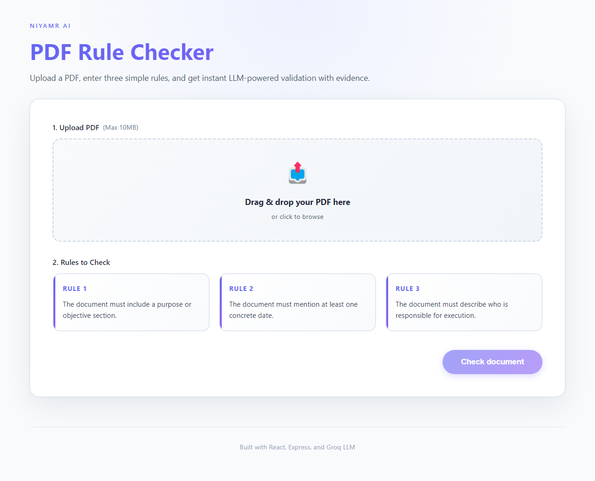

# NIYAMR AI – PDF Rule Checker

A professional full-stack web application that validates PDF documents against three **fixed** compliance rules using Groq LLM analysis. Upload any PDF (2–10 pages recommended) and receive instant PASS/FAIL judgments with detailed evidence, reasoning, and confidence scores.

## Stack

- **Frontend**: React 19, Vite, TypeScript, Modern CSS with animations
- **Backend**: Node.js 22, Express 5, Multer, pdf-parse
- **LLM Provider (fixed)**: 
  - Groq (default model: `openai/gpt-oss-20b`, OpenAI-compatible endpoint)
  - Optional support for Mistral (`mistral-medium-latest`) and OpenAI (`gpt-4o-mini`)
  - Automatic fallback to keyword heuristic when no API keys are configured

## Quick Start

```bash
git clone <repo-url>
cd "NiyamR PDF Checker"
```

### Backend

```bash
cd backend
cp env.example .env        # add your Groq (and optional Mistral/OpenAI) keys
npm install
npm run start              # or `npm run dev` with nodemon
```

Environment variables:

- `PORT`: HTTP port (default 4000)
- `OPENAI_API_KEY` / `OPENAI_MODEL`: Optional OpenAI key + model (default `gpt-4o-mini`)
- `MISTRAL_API_KEY` / `MISTRAL_MODEL`: Optional Mistral key + model (default `mistral-medium-latest`)
- `GROQ_API_KEY` / `GROQ_MODEL`: Groq key + model (default `openai/gpt-oss-20b`)
- `GROQ_BASE_URL`: Override Groq endpoint (defaults to `https://api.groq.com/openai/v1`)
- `LLM_PROVIDER`: Typically set to `groq` (can also be `openai` or `mistral` if enabled)

### Frontend

Open a new terminal:

```bash
cd frontend
cp env.example .env        # adjust API URL if needed
npm install
npm run dev                # Vite dev server on http://localhost:5173
```

Production build:

```bash
npm run build
npm run preview
```

## Deployment

- **Backend (Render/Railway)** – follow the official guide for deploying Node/Express apps: https://render.com/docs/deploy-node-express-app
- **Frontend (Vercel)** – deploy the Vite frontend by following Vercel’s Vite instructions: https://vercel.com/docs/frameworks/vite
- **Environment variables** – copy `backend/env.example` and `frontend/env.example`, fill in your keys, and configure the same values in the respective hosting dashboards.

## Usage

1. Start backend and frontend per above.
2. In the UI, upload a PDF (<=10 MB).
3. Review the three fixed rules:
   - The document must include a purpose or objective section.
   - The document must mention at least one concrete date.
   - The document must describe who is responsible for execution.
4. Click **“Check document”** to view pass/fail, evidence, reasoning, and confidence.

If no LLM keys are configured the backend falls back to a simple keyword heuristic so the flow still works (with lower confidence).

## API

`POST /api/check`

- Form-data fields:
  - `pdf`: PDF file
  - `rules`: JSON array of strings or single string
- Response:
  ```json
    {
      "meta": {
        "pageCount": 5,
        "model": "openai/gpt-oss-20b",
        "textLength": 8412
      },
    "results": [
      {
        "rule": "Document must mention a date.",
        "status": "pass",
        "evidence": "Found in page 1: “Published 2024”",
        "reasoning": "Document includes a publication year.",
        "confidence": 92
      }
    ]
  }
  ```

## Features

- ✅ **Modern, Professional UI** with smooth animations and responsive design
- ✅ **Groq LLM Integration** - Fixed Groq model (`openai/gpt-oss-20b`) by default
- ✅ **Real-time Analysis** with loading states and progress indicators
- ✅ **Detailed Results** - Evidence, reasoning, and confidence scores
- ✅ **Error Handling** - Clear error messages and validation
- ✅ **PDF Text Extraction** - Supports 2-10 page documents

## Screenshot



The interface features a clean, modern design with:
- Intuitive file upload with visual feedback
- Three clearly presented, fixed rules
- Professional results table with color-coded status badges
- Real-time model information and document metadata

## Testing

### Backend Testing
```bash
cd backend
npm run start  # or npm run dev for auto-reload
# Test with: POST http://localhost:4000/api/check
```

### Frontend Testing
```bash
cd frontend
npm run build  # Verify TypeScript compilation
npm run dev    # Development server with hot reload
```

### Health Check
```bash
curl http://localhost:4000/health
# Should return: {"status":"ok"}
```

## Troubleshooting

**Issue**: UI shows "Model: heuristic" instead of LLM model
- **Solution**: Ensure `.env` file exists in `backend/` with a valid `GROQ_API_KEY` (or optionally `MISTRAL_API_KEY` / `OPENAI_API_KEY`)
- Restart the backend server after adding keys

**Issue**: PDF upload fails
- **Solution**: Check file size (max 10MB) and ensure it's a valid PDF

**Issue**: LLM requests timeout
- **Solution**: Verify API key has sufficient quota/credits
- Check network connectivity to LLM provider

## Project Structure

```
NiyamR PDF Checker/
├── backend/
│   ├── src/
│   │   └── index.js          # Express API server
│   ├── .env                  # Environment variables (create from env.example)
│   └── package.json
├── frontend/
│   ├── src/
│   │   ├── App.tsx           # Main React component
│   │   ├── App.css           # Styling
│   │   └── types.ts          # TypeScript definitions
│   └── package.json
├── docs/
│   └── ui-screenshot.png     # Application screenshot
└── README.md
```

## Future Enhancements

- 🔄 Persist rule presets per user/session
- 🔄 UI toggle for selecting LLM provider at runtime
- 🔄 Highlight evidence in-context with page numbers
- 🔄 Export results as PDF/CSV
- 🔄 Batch document processing
- 🔄 Custom confidence thresholds

